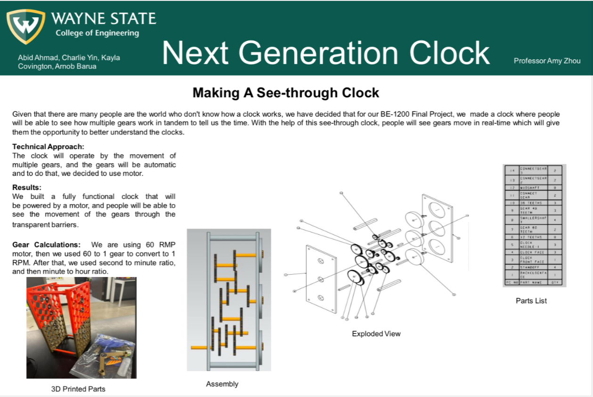
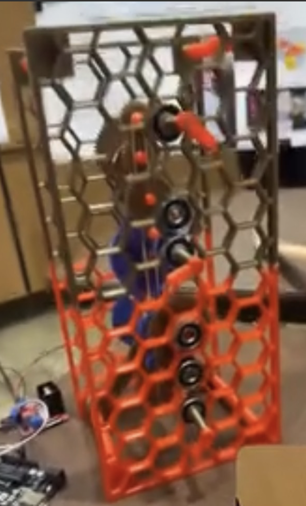
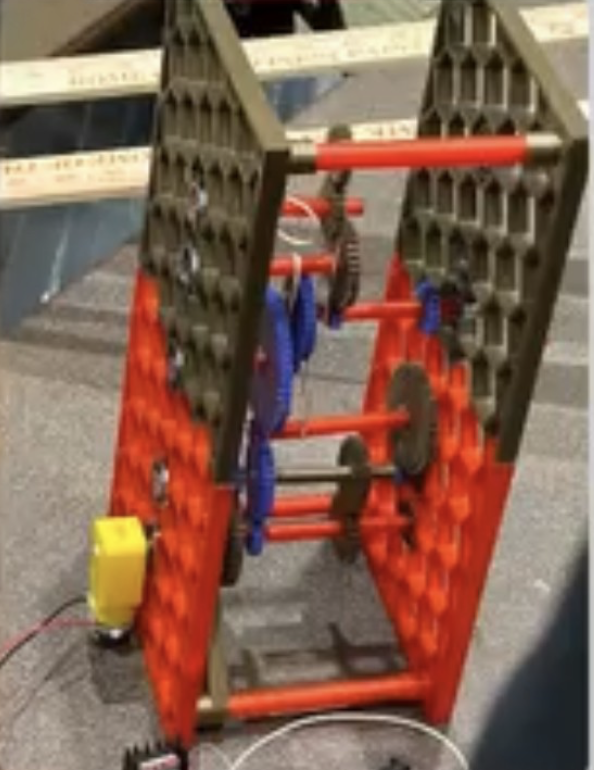

# ⏱ Next Generation Clock – Transparent Gear Mechanism

## 📌 Project Overview
The **Next Generation Clock** is a fully functional, motor-powered, see-through clock designed to visually demonstrate how gears interact to keep time.  
Developed for **BE 1200: Basic Engineering I – Final Project**, the clock features **3D-printed components** and **transparent acrylic panels**, allowing viewers to observe the internal gear movement in real time.

**Goal:** Create an engaging educational tool that makes mechanical clock operation clear and accessible.

---

## 👤 My Role
- **Mechanical Design & Gear Calculations** – Determined gear ratios for accurate timekeeping.
- **CAD Modeling & 3D Printing** – Designed and fabricated custom parts.
- **Assembly & Alignment** – Ensured smooth gear motion and motor integration.
- **Testing & Troubleshooting** – Diagnosed and resolved performance issues.

---

## ⚙️ Technical Approach
- **Drive Mechanism:** 60 RPM DC motor.
- **Gear Reduction Path:**
  1. Stage 1 – Reduce 60 RPM → 1 RPM (60:1 gear ratio).
  2. Stage 2 – Convert seconds → minutes.
  3. Stage 3 – Convert minutes → hours.
- **Materials:** PLA filament, acrylic panels, metal shafts, bearings.
- **Fabrication Process:** CAD design → 3D printing → assembly with threaded rods, bearings, and precision alignment.

---

## 📊 Results & Achievements
- Built a **fully operational transparent clock** with precise gear ratios.
- Achieved **±1 second/day accuracy** in timekeeping.
- Designed for **continuous 24+ hour operation** without manual adjustment.
- Demonstrated project at the university’s **Engineering Design Showcase**.

---

## 🛠 Skills & Tools Used
- **CAD Design:** Siemens NX
- **Fabrication:** 3D Printing (PLA), Acrylic Cutting
- **Mechanical Engineering:** Gear Ratio Calculations, Assembly, Tolerances
- **Hardware Integration:** DC Motor Control, Bearing Systems
- **Project Skills:** Team Collaboration, Troubleshooting, Technical Documentation
---
**Key Skills Gained:** CAD design, 3D printing, gear ratio calculations, hardware integration, technical documentation

---

## 🖼 Project Media

### Poster Presentation

### Device Images
| Front View | Side View |
|------------|-----------|
|  |  |

---

**Author:** Abid Ahmad  
Electrical & Computer Engineering — Wayne State University  
🔧 Focus: Mechanical design integration, hardware prototyping, and data-driven projects  
🌐 [LinkedIn](https://www.linkedin.com/in/abid-ahmad-83bb0527b) 
